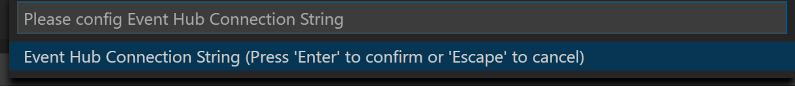

# vscode-azure-event-hub-explorer

This is a vscode extension to send message to or monitor messages in Azure Event Hub.

## Features

[x] Send messages to Azure Event Hub

[x] Monitor Event Hub messages

### Prerequisites

Required configurations include:
- eventHubConnectionString
- eventHubPath
- eventHubConsumerGroup
- showVerboseMessage

You could manually set them in settings.json with intellisense, and some of them have default values. Otherwise, an input box will pop up to remind you the input required settings value when you use the features.



## Commands

| Command | Keyboard Shortcuts | Menu Contexts |
| --- | --- | --- |
| Send message to Event Hub | None | editor/context |
| Start monitoring Event Hub message | None | editor/context |
| Stop monitoring Event Hub message | None | editor/context (in output panel) |

## Configuration

To set the Event Hub Connection String:
```json
{
    "azure-event-hub-explorer.eventHubConnectionString": "{Event Hub connection string}"
}
```

To set the Event Hub Path:
```json
{
    "azure-event-hub-explorer.eventHubPath": "{Event Hub path/name}"
}
```

To set the Event Hub Consumer Group (default is "$Default"):
```json
{
    "azure-event-hub-explorer.eventHubConsumerGroup": "$Default"
}
```

To set whether to show verbose info when monitoring messages (default is `false`):
```json
{
    "azure-event-hub-explorer.showVerboseMessage": false
}
```

## Issues
Submit [issues](https://github.com/summersun/vscode-azure-event-hub-explorer/issues) if any problems or suggestions.

## Contribution
Fork the [repo](https://github.com/summersun/vscode-azure-event-hub-explorer) and submit pull requests.